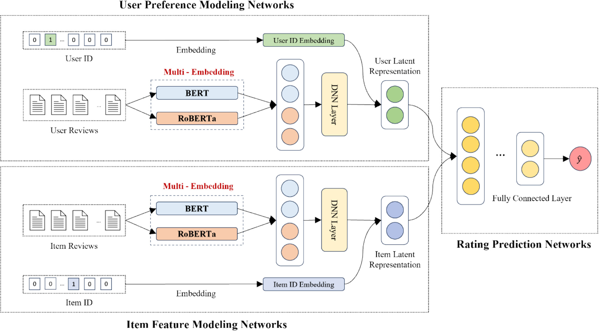

# A BERT-Based Multi-Embedding Fusion Method Using Review Text for Recommendation

Official implementation of the paper:
> **Lim, H., Li, Q., Yang, S., & Kim, J. (2025). A BERT‐Based Multi‐Embedding Fusion Method Using Review Text for Recommendation. Expert Systems, 42(5), e70041.**  [Paper Link](https://onlinelibrary.wiley.com/doi/full/10.1111/exsy.70041)

## Overview
This repository provides the official implementation of MFNR (Multi-Embedding Fusion Network for Recommendation), which enhances review-based recommendation by combining multiple pre-trained language models. MFNR integrates BERT and RoBERTa embeddings to capture richer user and item features from textual reviews. Experiments on Amazon and Goodreads datasets show that MFNR outperforms baseline models with an average improvement of 9.18% in RMSE and 14.81% in MAE, demonstrating the effectiveness of the multi-embedding fusion approach for recommender systems.

## Requirements
- Python 3.10
- pandas==2.2.3
- numpy==1.26.4
- ipykernel==6.29.5
- scikit-learn==1.5.2
- transformers==4.44.2
- torch==2.4.1
- torchvision==0.19.1
- pyarrow==17.0.0 

Install dependencies:
```bash
pip install -r requirements.txt
```

## Repository Structure

Below is the project structure for quick reference.

```bash
├── data/                        # Dataset directory
│   ├── raw/                     # Original (unprocessed) datasets
│   └── processed/               # Preprocessed data for training/evaluation
│
├── model/                       # Model definitions and checkpoints
│
├── src/                         # Core source code
│   ├── bert.py                  # BERT-based embedding and feature extraction module
│   ├── config.yaml              # Model and training configuration file
│   ├── path.py                  # Path and directory management utilities
│   └── utils.py                 # Helper functions (data loading, metrics, etc.)
│
├── main.py                      # Entry point for model training and evaluation
│
├── requirements.txt             # Python package dependencies
│
├── README.md                    # Project documentation
│
└── .gitignore                   # Git ignore configuration

```

## Model Description

MFNR (Multi-Embedding Fusion Network for Recommendation) is a review-based recommendation model that leverages BERT and RoBERTa to extract rich semantic features from textual reviews.  

The model consists of two parallel networks:  
- UPM (User Preference Modeling): captures user preferences from reviews written by users.  
- IFM (Item Feature Modeling): extracts item features from reviews written about items.  

Both networks share the same architecture but focus on different perspectives. The latent representations generated by UPM and IFM are combined and passed through a rating prediction network, which models nonlinear user–item interactions to predict ratings.

<p align="center">
  
</p>

## How to Run

### Environment Setup
Create a virtual environment and install all dependencies:
```bash
conda create -n mfnr python=3.10
conda activate mfnr
pip install -r requirements.txt
```

### Data Preparation
Place your dataset in the data/raw/ folder and preprocess it:
```bash
# Example: preprocess raw data and save to data/processed/
python src/utils.py --mode preprocess
```

### Train the Model
Run the training script with configuration file:
```bash
python main.py --config src/config.yaml --mode train
```

### Evaluate the Model
After training, evaluate using the saved checkpoint:
```bash
python main.py --config src/config.yaml --mode test
```

## Experimental Results

The performance of MFNR was evaluated on four real-world review datasets: Industrial and Scientific, Musical Instruments, Prime Pantry, and Goodreads. 
Results show that the proposed model consistently outperforms existing baselines in both RMSE and MAE metrics.

<table>
  <thead>
    <tr>
      <th rowspan="2">Model</th>
      <th colspan="2">Industrial and Scientific</th>
      <th colspan="2">Musical Instruments</th>
      <th colspan="2">Prime Pantry</th>
      <th colspan="2">Goodreads</th>
    </tr>
    <tr>
      <th>RMSE</th><th>MAE</th>
      <th>RMSE</th><th>MAE</th>
      <th>RMSE</th><th>MAE</th>
      <th>RMSE</th><th>MAE</th>
    </tr>
  </thead>
  <tbody>
    <tr><td>MF</td><td>1.430</td><td>1.342</td><td>1.433</td><td>1.344</td><td>1.421</td><td>1.331</td><td>1.246</td><td>0.967</td></tr>
    <tr><td>PMF</td><td>1.277</td><td>1.245</td><td>1.308</td><td>1.270</td><td>1.280</td><td>1.239</td><td>1.222</td><td>0.960</td></tr>
    <tr><td>HFT</td><td>1.275</td><td>1.056</td><td>1.271</td><td>1.068</td><td>1.213</td><td>1.015</td><td>1.121</td><td>0.875</td></tr>
    <tr><td>DeepCoNN</td><td>1.231</td><td>0.929</td><td>1.171</td><td>0.916</td><td>1.142</td><td>0.904</td><td>1.113</td><td>0.778</td></tr>
    <tr><td>NARRE</td><td>1.126</td><td>0.843</td><td>1.104</td><td>0.841</td><td>1.090</td><td>0.842</td><td>0.976</td><td>0.749</td></tr>
    <tr><td>DAML</td><td>1.102</td><td>0.839</td><td>1.099</td><td>0.833</td><td>1.033</td><td>0.826</td><td>0.969</td><td>0.739</td></tr>
    <tr><td>AENAR</td><td>1.100</td><td>0.836</td><td>1.098</td><td>0.831</td><td>1.028</td><td>0.817</td><td>0.968</td><td>0.738</td></tr>
    <tr><td>SAFMR</td><td>1.100</td><td>0.833</td><td>1.097</td><td>0.830</td><td>1.023</td><td>0.802</td><td>0.966</td><td>0.735</td></tr>
    <tr><td><b>Proposed (MFNR)</b></td><td><b>1.087</b></td><td><b>0.803</b></td><td><b>1.094</b></td><td><b>0.823</b></td><td><b>1.017</b></td><td><b>0.763</b></td><td><b>0.965</b></td><td><b>0.724</b></td></tr>
  </tbody>
</table>

## Citation

If you find this work useful in your research, please cite our paper:

```bibtex
@article{lim2025bert,
  title     = {A BERT-Based Multi-Embedding Fusion Method Using Review Text for Recommendation},
  author    = {Lim, H. and Li, Q. and Yang, S. and Kim, J.},
  journal   = {Expert Systems},
  volume    = {42},
  number    = {5},
  pages     = {e70041},
  year      = {2025},
  publisher = {Wiley},
  doi       = {10.1111/exsy.70041}
}
```

## Contact

For questions, collaborations, or feedback, please contact:  
**Qinglong Li (이청용)**  
Assistant Professor, Division of Computer Engineering, Hansung University  
Email: [leecy@hansung.ac.kr](mailto:leecy@hansung.ac.kr)

_Last updated: **October 2025**_
